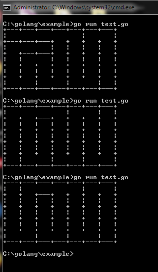

## Random Maze Generator

A maze can be generated by starting with a predetermined arrangement of cells with wall sites between them. This predetermined arrangement can be considered as a connected graph with the edges representing possible wall sites and the nodes representing cells. The purpose of the maze generation algorithm can then be considered to be making a sub-graph in which it is challenging to find a route between two particular nodes.

Given an input, generate a random Maze.

### Examples

**Example 1**

```text
DrawMaze(5,7)
```

**Output**

<p align="left">
  
</p>

**Example 2**

```text
DrawMaze(4,6)
```

**Output**

```text
+---+---+---+---+---+---+
|   |           |       |
+   +   +   +---+   +---+
|   |   |           |   |
+   +   +---+---+---+   +
|   |   |               |
+   +   +   +---+---+   +
|           |           |
+---+---+---+---+---+---+
```
