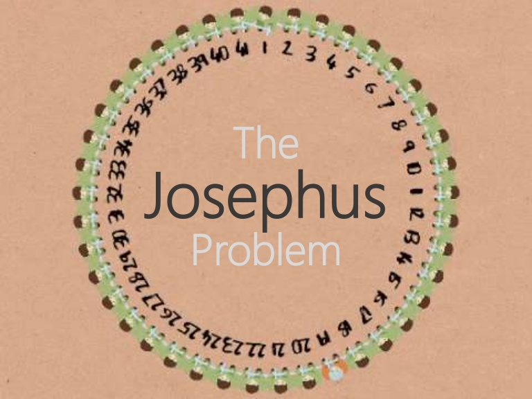

## The Josephus Problem

This classic problem dates back to Roman times. There are 41 soldiers arranged in a circle. Every third soldier is to be killed by their captors, continuing around the circle until only one soldier remains. He is to be freed. Assuming you would like to stay alive, at what position in the circle would you stand?

Generalize this problem by creating a function that accepts the number of soldiers `n` and the interval at which they are killed `i`, and returns the position of the fortunate survivor.

<p align="left">
  
</p>

### Example

```text
josephus(41, 3) ➞ 31

josephus(35, 11) ➞ 18

josephus(11, 1) ➞ 11

josephus(2, 2) ➞ 1
```

### Notes

- Assume the positions are numbered 1 to `n` going **clockwise** around the circle.
- If the interval is 3, the first soldiers to die are at positions 3, 6, and 9.
