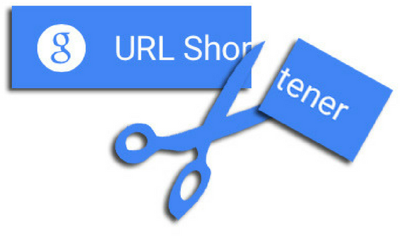

## URL Shortener

URL shortening is used to create shorter aliases for long URLs. We call these shortened aliases “short links.” Users are redirected to the original URL when they hit these short links. Short links save a lot of space when displayed, printed, messaged, or tweeted. Additionally, users are less likely to mistype shorter URLs. URL shortening is used to optimize links across devices, track individual links to analyze audience, measure ad campaigns’ performance, or hide affiliated original URLs.

  

---

### Constraints

- Given a URL, our service should generate a shorter and unique alias of it. This is called a short link. This link should be short enough to be easily copied and pasted into applications.
- Users should optionally be able to pick a custom short link for their URL.
- URL format must be validated
- URL < 200 characters
- Shortened links should not be guessable (not predictable).
