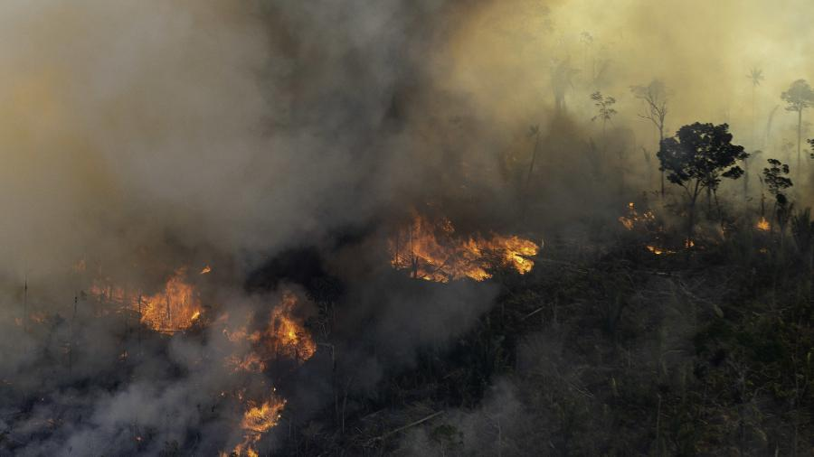

## Marcio Mello's Challenge

The deforested are of the Amazon rain Forest was 9,762 km² between August 2018 and July 2019, according to official figures from the federal government Inpe (National Institute for Space Research).
This is an increase of 29.5% over the previous period (August 2017 to July 2018), which recorded 7,536 km² of deforested area. The proeminent brazilian matematician **Marcio Mello**, calculated the deforest area in football fields to make it easier to regular people to understand how big is the damage of the current government to the environment.
Taking him as an example, create an algorithm that given a deforested area (in km2) it returns the correspondent amount of football fields.

<p align="left">
  
</p>

## Examples

```text
input: 1.034

result: 100.000 football fields
```

## Constraints

- Fifa standard football field: `105m x 68m`
