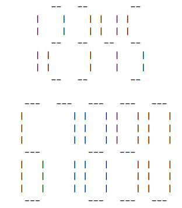

# LCD Display

A friend of yours has just bought a new computer. Before this, the most powerful machine he ever used was a pocket calculator. He is a little disappointed because he liked the LCD display of his calculator more than the screen on his new computer! To make him happy, write a program that prints numbers in LCD display style.

## Objective
Write a **toLCD** function which returns a LCD display representation as a string.

The function has one input parameter:
- **n**: integer to be converted to LCD display
- **s**: size as number of signs

The function returns:
-  LCD display representation as a string

Print the number specified in the input in an LCD display-style using s “-” signs for the horizontal segments ands “|” signs for the vertical ones. Each digit occupies exactly s + 2 columns and 2s + 3 rows. 

Be sure to fill all the white space occupied by the digits with blanks, including the last digit. There must be exactly one column of blanks between two digits.

### Examples for input (n=12345, s=2) and (n=67890, s=3):

  

