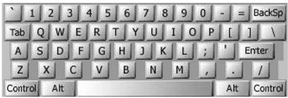

# WERTYU

A common typing error is to place your hands on the keyboard one row to the right of the correct position. Then “Q” is typed as “W” and “J” is typed as “K” and so on.

<p align="left">
  
</p>

Your task is to decode a message typed in this manner.

## Details

Write a **keyboardMistakeFix** function which prints the corret string for the input given. 
The function has the following parameter:
- **input**: may contain digits, spaces, uppercaseletters (except “Q”, “A”, “Z”), or punctuation shown above [except back-quote (‘)]. 

Returns:
- You are to replace each letter or punctuation symbol by the one immediately to its lefton the QWERTY keyboard shown above. Spaces in the input should be echoed in the output.

## Constraints
- Keys labeled with words [Tab,BackSp,Control, etc.] are not represented in the input.


### Example
```text
keyboardMistakeFix("O S, GOMR YPFSU/") ➞ "I AM FINE TODAY."
```
