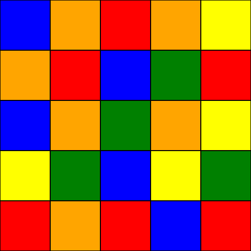
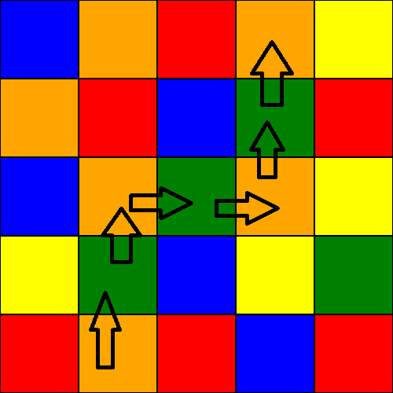

# Color maze

Today we are going to do something colorfull and amazing. Yes it is a color maze :D (you can downvote me now, it was totally worth it).

You traverse a color by following a sequence of colors. For example this maze can be solved by the sequence 'orange -> green':

<p align="center">
  
</p>

Then you would have something like this (paint skills):

<p align="center">
  
</p>

For the mazes you always pick a spot on the bottom, in the starting color and try to get to the first row. Once you reach the first row, you are out of the maze. The sequence does not have to be complete.

You can move horizontally and vertically, but not diagonally. It is also allowed to move on the same node more then once.

## Objective

Write a function with **two input parameters**:
- Sequence of colors to follow as a array/vector of chars
- The maze as a array/vector of chars

## Output
The path in the maze as coordinates x, y.

## Example
```text
COLOR SEQUENCE: R W

MAZE:
[
  R  O  G
  W  R  W
  G  O  R
  O  R  W
]

SOLUTION:
(1, 3)
(2, 3)
(2, 2)
(2, 1)
(1, 1)
(0, 1)
(0, 0)

--------------------------------------------------------------------------------

COLOR SEQUENCE: R W

MAZE:
[
  R  O  G
  W  R  W
  G  O  O
  O  R  W
]

SOLUTION: NO SOLUTION!
--------------------------------------------------------------------------------

COLOR SEQUENCE: O G

MAZE:
[
  C  O  R  O  Y
  O  R  V  G  R
  G  O  G  O  G
  Y  G  B  Y  G
  R  O  R  B  R
]

SOLUTION:
(1, 4)
(1, 3)
(1, 2)
(2, 2)
(3, 2)
(3, 1)
(3, 0)

--------------------------------------------------------------------------------

COLOR SEQUENCE: O G

MAZE:
[
  B  O  R  O  Y
  O  R  B  G  R
  B  O  G  O  Y
  Y  G  B  Y  G
  R  O  R  B  R
]

SOLUTION:
(1, 4)
(1, 3)
(1, 2)
(2, 2)
(3, 2)
(3, 1)
(3, 0)

--------------------------------------------------------------------------------

COLOR SEQUENCE: O G

MAZE:
[
  G  O  R  O  Y
  O  R  B  C  R
  G  O  G  O  G
  Y  G  B  Y  G
  R  O  R  B  R
]

SOLUTION:
(1, 4)
(1, 3)
(1, 2)
(0, 2)
(0, 1)
(0, 0)

--------------------------------------------------------------------------------

COLOR SEQUENCE: R O Y P O

MAZE:
[
  R  R  B  R  R  R  B  P  Y  G  P  B  B  B  G  P  B  P  P  R
  B  G  Y  P  R  P  Y  Y  O  R  Y  P  P  Y  Y  R  R  R  P  P
  B  P  G  R  O  P  Y  G  R  Y  Y  G  P  O  R  Y  P  B  O  O
  R  B  B  O  R  P  Y  O  O  Y  R  P  B  R  G  R  B  G  P  G
  R  P  Y  G  G  G  P  Y  P  Y  O  G  B  O  R  Y  P  B  Y  O
  O  R  B  G  B  Y  B  P  G  R  P  Y  R  O  G  Y  G  Y  R  P
  B  G  O  O  O  G  B  B  R  O  Y  Y  Y  Y  P  B  Y  Y  G  G
  P  P  G  B  O  P  Y  G  B  R  O  G  B  G  R  O  Y  R  B  R
  Y  Y  P  P  R  B  Y  B  P  O  O  G  P  Y  R  P  P  Y  R  Y
  P  O  O  B  B  B  G  O  Y  G  O  P  B  G  Y  R  R  Y  R  B
  P  P  Y  R  B  O  O  R  O  R  Y  B  G  B  G  O  O  P  B  Y
  B  B  R  G  Y  G  P  Y  G  P  R  R  P  Y  G  O  O  Y  R  R
  O  G  R  Y  B  P  Y  O  P  B  R  Y  B  G  P  G  O  O  B  P
  R  Y  G  P  G  G  O  R  Y  O  O  G  R  G  P  P  Y  P  B  G
  P  Y  P  R  O  O  R  O  Y  R  P  O  R  Y  P  Y  B  B  Y  R
  O  Y  P  G  R  P  R  G  P  O  B  B  R  B  O  B  Y  Y  B  P
  B  Y  Y  P  O  Y  O  Y  O  R  B  R  G  G  Y  G  R  G  Y  G
  Y  B  Y  Y  G  B  R  R  O  B  O  P  P  O  B  O  R  R  R  P
  P  O  O  O  P  Y  G  G  Y  P  O  G  P  O  B  G  P  R  P  B
  R  B  B  R  R  R  R  B  B  B  Y  O  B  G  P  G  G  O  O  Y
]

SOLUTION:
(3, 19)
(3, 18)
(3, 17)
(3, 16)
(4, 16)
(4, 15)
(4, 16)
(5, 16)
(5, 15)
(5, 14)
(6, 14)
(6, 13)
(6, 12)
(6, 11)
(6, 10)
(7, 10)
(7, 9)
(8, 9)
(8, 8)
(9, 8)
(9, 7)
(9, 6)
(10, 6)
(10, 5)
(10, 4)
(10, 3)
(10, 4)
(9, 4)
(8, 4)
(8, 3)
(8, 2)
(8, 1)
(8, 0)
```
