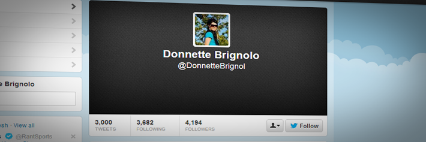
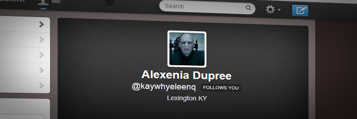
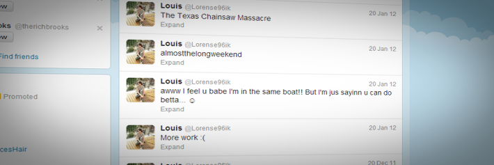
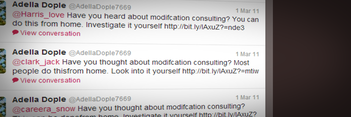
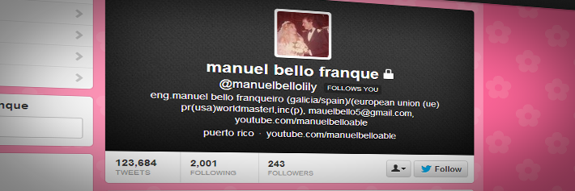

## CATTLEMETER

Researchers say bot networks exist that number in the hundreds of thousands, with accounts that share similar characteristics, suggesting someone is using them for a specific purpose. The Russian troll factory known as the Internet Research Agency reportedly used large networks of fake accounts to distribute misinformation in an attempt to destabilize the US election.

An analysis by researchers at Oxford University showed more than a third of pro-Trump tweets and nearly a fifth of pro-Clinton tweets between the first and second debates came from automated accounts, which produced more than 1 million tweets. Many of these same trolls and bot networks were also reportedly active in the Virginia state elections, amplifying race-baiting tweets by Donald Trump.

Bot networks are also used in some cases to attack journalists by flooding their accounts with suspicious activity, which often results in their accounts being suspended or banned.

The same problem happens in Brazil, where the current president (far-right) has very close ties with bot farms and there is enough profs to link one of his sons to a leader of a group called "the hate cabinet", which is responsible for milions of fake accounts and to spread fake news all the time to favor the president or discredit the opponents.

People who still supports the current Brazil president are knowed as "cattle", as they just follow whatever the president spits.

In order to contain the advance of this bot practices, you need to create an algorithm that given a twitter account, it tells if it's fake or not, using a scale from 0 (not a bot) to 100 (definetily a bot).

The current constrains must be taken into account:

### An Egghead

<p align="left">
  
</p>

By egghead, I am referring to the Twitter user in question not taking the time to upload a profile image. Most real people will upload some sort of profile image. While not every egghead is a fake or bot account, this is typically a sign of a lazy person. Or a bot.

### Stock Profile Images

<p align="left">
  
</p>

While this move might be a step up from being an egghead, most fake accounts get this wrong. They either use stock images or a profile image shared by other fake accounts.

**[PRO TIP]** Use Google to find out if a profile image has been used by others. To do this you can right click on the profile image and copy the link location. Then simply go to Google Images and search by URL. Paste the URL and find out if others are using this same image.

**[BONUS TIP]** Narrow down your search to just Twitter results by added “site:twitter.com”

### No Bio

An empty Twitter bio is almost a dead giveaway that the profile you are looking at is a dud. This underutilized real estate is key to informing your followers (or potential followers) who you are and what you’re about. Skipping over this is typically a sign of not only laziness, but a tell-tale sign the account is almost certainly fake.

### Excessive Duplicate Tweets

While this does not run rampant like it previously did, if you see a profile’s stream that is all the exact same or very similar tweets, chances are that you are viewing a fake account.
Most notably, if the tweets are all @replies with the same text, you have found a bot account. While there is no doubt some excessive self promotion on Twitter, some accounts constantly tweet the same thing. Odds are a human is not behind each of those tweets, and better yet it is a sign of someone who does not use automation effectively.

### Confusing Screen Name / URL Combination

<p align="left">
  
</p>

This is an easy one. There are multiple things to look for in a screen name. The first is if you see the profile URL as something like “twitter.com/john-smith” but when you view the profile, the first and last name listed above the bio has no relation to the URL. For example, it would say something like “Sarah Jones” which obviously has no direct relation to “John Smith” that is in the URL.

The other red flag regarding screen names and URL combinations is if you see an incoherent URL like “twitter.com/kaywhyeleenq”. Viewing this URL you will see that while this profile has many red flags, the first and last name listed in the profile has no direct relation to the URL. While, not all profiles will have a direct relation, most of the time if the URL does not even contain legitimate words or phrases, it is a common sign the profile was automatically generated via software and not a human.

### Incoherent Tweets

<p align="left">
  
</p>

Most of the time fake Twitter accounts simply spew off tweets that directly benefit themselves, like linking directly to their site. However, there are many fake accounts that simply post gibberish or random incoherent thoughts that make absolutely no sense.

### Has Not Tweeted in Years

<p align="left">
  
</p>

Back in the earlier, wild-west days of Twitter, automation was manipulated quite a bit. However, as Twitter has evolved their API access and rules, previous bots and some of their automation no longer work. An easy way to spot this is in accounts that have not tweeted in months or even years. Looking at the time stamp of the most recent tweets, you can get a good idea of the Twitter account is no longer active. For example, the Twitter account in the image above has not tweeted since 2011.

### Follows 2,001 People

Twitter has limits on certain things you can do. For example, how many people you can follow. This limit is set to 2,000. Once you follow 2,001 people, you must have at least 2,000 people following you back before you can exceed the 2,001 limit. A common limitation of bots is that they are not smart enough to manage their following restrictions to get around this limitation. Therefore, many fake accounts get stuck on following 2,001 users.
Once an account gets past the 2,001 following limitation, then I believe the unwritten rule is that you can follow 10% more than are following you. So if your account has 2,000 users following it, then theoretically you can follow approximately 2,200 users.

### No Interaction With Others

Accounts that show no signs of interaction with others are often fake accounts. Social media is meant to be a two-way conversation. Those accounts who simply do not interact with others is often a sign of a bot account.
The quick way to find out if there is interaction with other users is to simply view recent tweets by the user. If you can see that within their last 20-30 tweets there are no @replies or retweets, chances are the account you are looking at is automated/fake.

### No or Low Follower Counts

Another common sign of a bot account is an account that does not tend to have anyone following the account back. This is commonly seen with accounts that are following 2,001 users but only have a handful of accounts following back. While there are a number of reasons someone may not want to follow an account, chances are in this case it is due to the account not being worth one to follow. Twitter users are becoming smarter at whether or not someone deserves to be followed back.

### An Unrealistic Amount of Tweets

<p align="left">
  
</p>

No doubt automation has its place in Twitter when used responsibly. However, a sure sign of an automated/fake account is typically an insane amount of tweets that is more than likely not humanly possible. I mean, who has the time to tweet 123,684 times? In the image above you can see how tweeting this often did wonders for increasing the amount of followers for this account.

## The Cattle Scale

For each of the above items that an account triggers, add 10 to the score. The output should consider the following scale:

- 0 - 20 - Not a cattle
- 21 - 80 - Sounds like a cattle (muhhhh)
- 81 - 100 - It's definetely a cattle ! Avoid it !
- 100+ - Too much cattle! 🐮

## Input example

```
input: @DaniloGentili
output: Too much cattle! 🐮
```
