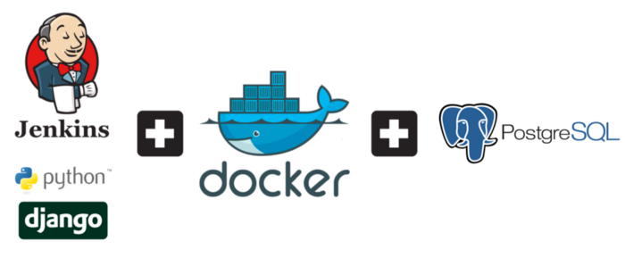

## Docker - CI/CD Pipeline

In software engineering, CI/CD or CICD generally refers to the combined practices of continuous integration and continuous delivery (aka continuous deployment).

In this challenge, you need to set up a CICD pipeline using Jenkins (or any other tool you like). The idea is to create a pipeline to build all the code you have developed so far in this challenge. To make things even more interesting,
you need to dockerized a microservice (Django/Wordpress/Nginx) and use Postgres/SQL as a database. You're free to add more services to the stack as well.

  

---

### Constraints

- You need to use a CI/CD tool in the stack
- The whole stack need to be containerized
- You need to use Docker Compose
- Kubernetes is a plus
